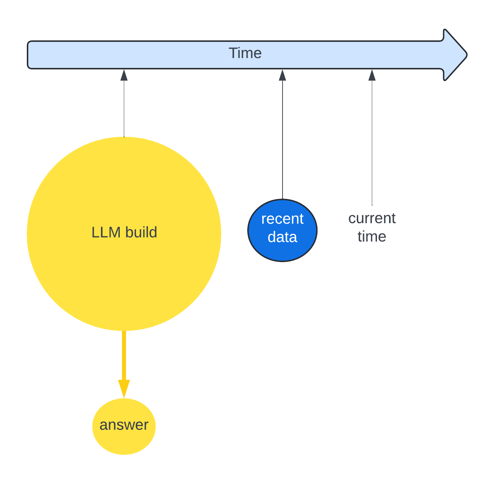
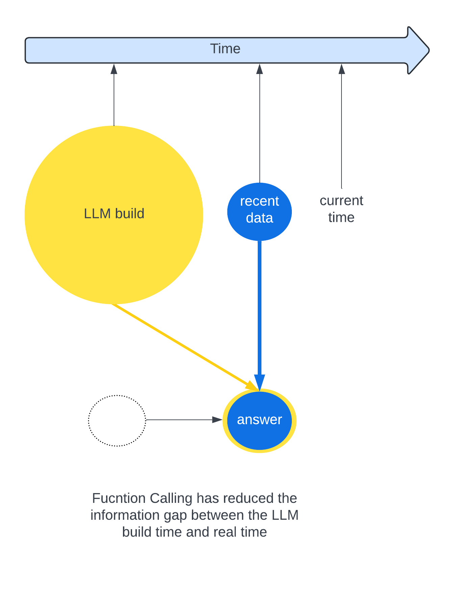
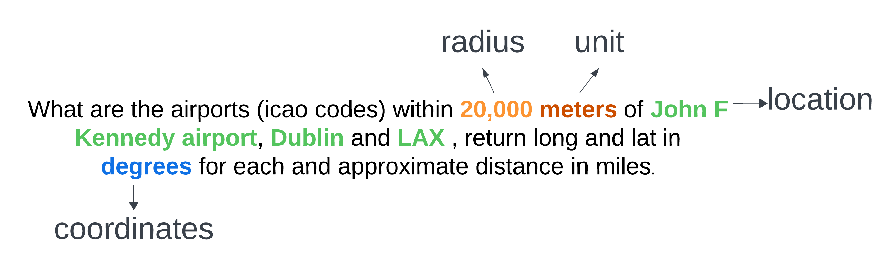
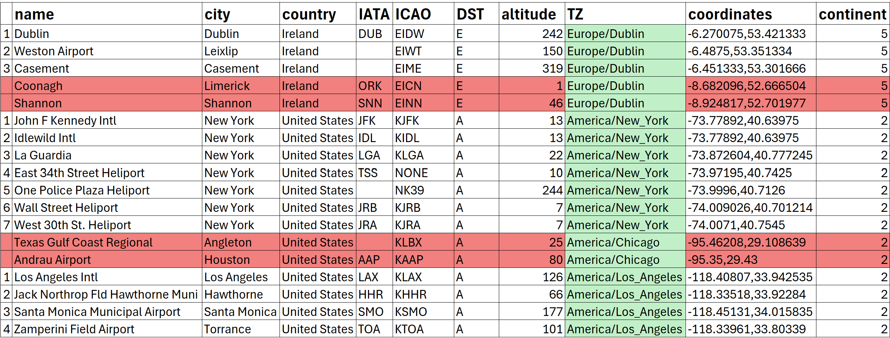
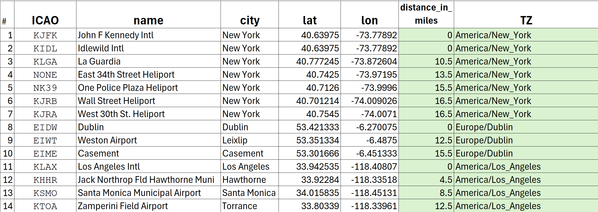

# OpenAI - Function Calling Demo - using Python

## Bridging The Gap
### Build Time to Current Time
The LLM model is created or built at a particular time. 

The model can only report on information that it knows at that specific time.


For example, let's say the LLM was built last month. In the meantime, a car manufacturer has just released a new car and has published details of the car.
The LLM will not be aware of the new model and will be unable to report appropriately. 





### with Function Calling

_Function Calling_ allows the user to add their data (recent data) to the model to allow for refined answers from the model. 

Details of the car can be added to the model to give an augmented answer.

The example code given by OpenAI, is to get the weather in 3 locations. The LLM can't possibly know what the weather is, that's real time information, but it can use "Function Calling" to get the weather from an api to give a "near to real time" response.



### Objective
"What are the airports (icao codes) within 20,000 meters of John F Kennedy airport, Dublin and LAX , return long and lat in degrees for each and approximate distance in miles. All output is to be in json. The json fields to include are ICAO, name, city, lat, lon, distance_in_miles and TZ. The set should be called ICAOS".

#### Background
An ICAO code is like a zip code for an airport. It is a 4 digit alphanumeric that uniquely identifies an airport/airfield. e.g. EINN is the ICAO for Shannon Airport, Ireland. KJFK is the code for John F Kennedy.

This request would not be a typical use case. It does however demonstrate the type of responses that OpenAI can return.

# [Function Calling](https://cookbook.openai.com/examples/how_to_call_functions_with_chat_models) - with model generated arguments

Function calling gets more reliably structured data back from the model.

Function calling is a 4-step process:

## Step 1: send the conversation and available functions to the model
OpenAI will identify the arguments required from the request
## Step 2 :check if the model wanted to call a function
For this demo, the model called a function, 3 times, once for each location.
Note how the model was able to determine the model arguments from the request.

### 1st time function call:

`Function: get_icao `

`Params:{"location": "John F Kennedy airport", "radius": 20, "unit": "miles", "coordinates": "decimal"}`

### 2nd time function call:
`
Function: get_icao`

`
Params:{"location": "Dublin", "radius": 20, "unit": "miles", "coordinates": "decimal"}
`
### 3rd time function call:
`
Function: get_icao
`

`
Params:{"location": "LAX", "radius": 20, "unit": "miles", "coordinates": "decimal"}
`
## Step 3: call the function
## Step 4: send the info for each function call and function response to the model


    OpenAI will augment the data supplied by the user function call with OpenAI modifications
    The data supplied by the user did not contain a distance. OpenAI augmented that information on the second pass of the model.

20,000 meters is an unusual amount. Why not just say 20 km ? OpenAI can handle this and do the conversion.
20km is around 12.4 miles.
One api call will not facilitate a final solution for this use case. 3 separate api calls will be required to facilitate a final solution, one call for each airfield.

For the purpose of this demo, the data is supplied in json format from 3 separate file, one file representing each location.


## Create an OpenAI account

[OpenAI Quickstart](https://platform.openai.com/docs/quickstart)


set up an OPENAI API KEY
### Model

This python script will use model_version = `gpt-4o`

OpenAI has different model offerings and price points. [models and price points](https://platform.openai.com/docs/models)
                                                                                 
# Install packages to run the demo


Manage environment variables, sensitive information. Hide the api key from public view for security
```python
pip install python_dotenv  
```
Install or upgrade the OpenAI Python package
```python
pip install --upgrade openai
```

# Python Code 
[sample OpenAI function calling example](https://cookbook.openai.com/examples/how_to_call_functions_with_chat_models)


The supplied openai code has been modified to:
1. use dotenv to hide the api key
2. modify the content for my use case: `"What are the icao codes within 20000 meters of John F Kennedy airport, Dublin and LAX , return long and lat in degrees for each and approximate distance in miles ?".`


## Python Code - build json for api call using model generated arguments 
```python
def get_icao(location, radius, unit, coordinates):
    """Build Json for call to api"""

    icao_info = {
        "location": location,
        "radius": radius,
        "unit": unit,
        "coordinates": coordinates
    }
    # The actual code has 3 calls to json files to simulate the passing of data.
    json_string = json.dumps(icao_info)
    print(
        f"Run your api here with the parameters extracted from the request: {json_string}\n")
    return json_string
```


## Model Generated Arguments
The parameters that are required for our use case are detailed with a type and description. A detailed and specific description is required in order to inform openai had to handle the response.
For our custom api, we will require: location, radius, unit and coordinates. 

### Definitions:

1. Location 
```
location: {"type": "string","description": "The city and state, e.g. San Francisco, CA",},
```
2. radius
```
radius: {"type": "integer", "description": "distance from location in kilometers or miles"},
```
3. unit - kilometers or miles

Inform OpenAI that kilometers or miles are required as a model argument using an enumerator.

```
unit: {"type": "string","description": "kilometers or miles","enum": ["kilometers", "miles"]},
```
4. coordinates - in minutes or decimal

The request did not specifically ask for longitude and latitude, it asked for long and lat, however OpenAI was able to work out by context
that longitude and latitude were required.
Inform OpenAI that a model argument of either minutes or decimal is required, using an enumerator.
```
coordinates: {"type": "string","description": "longitude and latitude", "enum": ["minutes", "decimal"]},
```

Using these definitions, the model arguments can be determined from the request.




## Python Code - define the model generated arguments


```python
def run_conversation(user_content: str):
    # Step 1: send the conversation and available functions to the model
    messages = [{"role": "user",
                 "content": user_content}]
    tools = [
        {
            "type": "function",
            "function": {
                "name": "get_icao",
                "description": "Get the 4 digit ICAO code for a given location",
                "parameters": {
                    "type": "object",
                    "properties": {
                        "location": {
                            "type": "string",
                            "description": "The city and state, e.g. San Francisco, CA",
                        },
                        "radius": {
                            "type": "integer",
                            "description": "distance from location in kilometers or miles",
                        },
                        "unit": {"type": "string",
                                 "description": "kilometers or miles",
                                 "enum": ["kilometers", "miles"]},
                        "coordinates": {"type": "string",
                                        "description": "longitude and latitude",
                                        "enum": ["minutes", "decimal"]},
                    },
                    "required": ["location"],
                },
            },
        }
    ]
    

```

The model can extract arguments from the prompt to build JSON to use in api calls: 
```JSON 
{"location": "John F Kennedy Airport, NY", "radius": 20, "unit": "kilometers", "coordinates": "decimal"}
{"location": "Dublin, Ireland", "radius": 20, "unit": "kilometers", "coordinates": "decimal"}
{"location": "LAX, CA", "radius": 20, "unit": "kilometers", "coordinates": "decimal"}
```

# OpenAI Generated Output 
## Response from the chat request:

```
Request: What are the airports (icao codes) within 20000 meters of John F Kennedy airport, Dublin and LAX , return long and lat in degrees for each and approximate distance in miles. All output is to be in json. The json fields to include are ICAO, name, city, lat, lon, distance_in_miles and TZ. The set shoud be called ICAOS

Model Function Call: get_icao
Params:{"location": "John F Kennedy airport", "radius": 20, "unit": "kilometers", "coordinates": "decimal"}

Model Function Call: get_icao
Params:{"location": "Dublin", "radius": 20, "unit": "kilometers", "coordinates": "decimal"}

Model Function Call: get_icao
Params:{"location": "LAX", "radius": 20, "unit": "kilometers", "coordinates": "decimal"}

JSON returned:
```  
```JSON
{
  "ICAOS": [
    {
      "ICAO": "KJFK",
      "name": "John F Kennedy Intl",
      "city": "New York",
      "lat": 40.63975,
      "lon": -73.77892,
      "distance_in_miles": 0,
      "TZ": "America/New_York"
    },
    {
      "ICAO": "KIDL",
      "name": "Idlewild Intl",
      "city": "New York",
      "lat": 40.63975,
      "lon": -73.77892,
      "distance_in_miles": 0,
      "TZ": "America/New_York"
    },
    {
      "ICAO": "KLGA",
      "name": "La Guardia",
      "city": "New York",
      "lat": 40.777245,
      "lon": -73.872604,
      "distance_in_miles": 10.5,
      "TZ": "America/New_York"
    },
    {
      "ICAO": "NONE",
      "name": "East 34th Street Heliport",
      "city": "New York",
      "lat": 40.7425,
      "lon": -73.97195,
      "distance_in_miles": 12.5,
      "TZ": "America/New_York"
    },
    {
      "ICAO": "NK39",
      "name": "One Police Plaza Heliport",
      "city": "New York",
      "lat": 40.7126,
      "lon": -73.9996,
      "distance_in_miles": 15.5,
      "TZ": "America/New_York"
    },
    {
      "ICAO": "KJRB",
      "name": "Wall Street Heliport",
      "city": "New York",
      "lat": 40.701214,
      "lon": -74.009026,
      "distance_in_miles": 16.5,
      "TZ": "America/New_York"
    },
    {
      "ICAO": "KJRA",
      "name": "West 30th St. Heliport",
      "city": "New York",
      "lat": 40.7545,
      "lon": -74.0071,
      "distance_in_miles": 15.5,
      "TZ": "America/New_York"
    },
    {
      "ICAO": "EIDW",
      "name": "Dublin",
      "city": "Dublin",
      "lat": 53.421333,
      "lon": -6.270075,
      "distance_in_miles": 0,
      "TZ": "Europe/Dublin"
    },
    {
      "ICAO": "EIWT",
      "name": "Weston Airport",
      "city": "Leixlip",
      "lat": 53.351334,
      "lon": -6.4875,
      "distance_in_miles": 12.5,
      "TZ": "Europe/Dublin"
    },
    {
      "ICAO": "EIME",
      "name": "Casement",
      "city": "Casement",
      "lat": 53.301666,
      "lon": -6.451333,
      "distance_in_miles": 15.5,
      "TZ": "Europe/Dublin"
    },
    {
      "ICAO": "KLAX",
      "name": "Los Angeles Intl",
      "city": "Los Angeles",
      "lat": 33.942535,
      "lon": -118.40807,
      "distance_in_miles": 0,
      "TZ": "America/Los_Angeles"
    },
    {
      "ICAO": "KHHR",
      "name": "Jack Northrop Fld Hawthorne Muni",
      "city": "Hawthorne",
      "lat": 33.92284,
      "lon": -118.33518,
      "distance_in_miles": 4.5,
      "TZ": "America/Los_Angeles"
    },
    {
      "ICAO": "KSMO",
      "name": "Santa Monica Municipal Airport",
      "city": "Santa Monica",
      "lat": 34.015835,
      "lon": -118.45131,
      "distance_in_miles": 8.5,
      "TZ": "America/Los_Angeles"
    },
    {
      "ICAO": "KTOA",
      "name": "Zamperini Field Airport",
      "city": "Torrance",
      "lat": 33.80339,
      "lon": -118.33961,
      "distance_in_miles": 12.5,
      "TZ": "America/Los_Angeles"
    }
  ]
}
```
## JSON output specified for the model

### [JSON Mode](https://platform.openai.com/docs/guides/text-generation/json-mode)
set the response format
```Python
second_response = client.chat.completions.create(
            model=model_version,
            messages=messages,
            response_format={"type": "json_object"},       #<<<<<<<<<<<<<<<< JSON
            # stream=True
        ) 
         
```


Process JSON data example output:
```
<class 'dict'>
{'ICAO': 'KJFK', 'name': 'John F Kennedy Intl', 'city': 'New York', 'lat': 40.63975, 'lon': -73.77892, 'distance_in_miles': 0, 'TZ': 'America/New_York'}
{'ICAO': 'KIDL', 'name': 'Idlewild Intl', 'city': 'New York', 'lat': 40.63975, 'lon': -73.77892, 'distance_in_miles': 0, 'TZ': 'America/New_York'}
{'ICAO': 'KLGA', 'name': 'La Guardia', 'city': 'New York', 'lat': 40.777245, 'lon': -73.872604, 'distance_in_miles': 10.5, 'TZ': 'America/New_York'}
{'ICAO': 'NONE', 'name': 'East 34th Street Heliport', 'city': 'New York', 'lat': 40.7425, 'lon': -73.97195, 'distance_in_miles': 12.5, 'TZ': 'America/New_York'}
{'ICAO': 'NK39', 'name': 'One Police Plaza Heliport', 'city': 'New York', 'lat': 40.7126, 'lon': -73.9996, 'distance_in_miles': 15.5, 'TZ': 'America/New_York'}
{'ICAO': 'KJRB', 'name': 'Wall Street Heliport', 'city': 'New York', 'lat': 40.701214, 'lon': -74.009026, 'distance_in_miles': 16.5, 'TZ': 'America/New_York'}
{'ICAO': 'KJRA', 'name': 'West 30th St. Heliport', 'city': 'New York', 'lat': 40.7545, 'lon': -74.0071, 'distance_in_miles': 15.5, 'TZ': 'America/New_York'}
{'ICAO': 'EIDW', 'name': 'Dublin', 'city': 'Dublin', 'lat': 53.421333, 'lon': -6.270075, 'distance_in_miles': 0, 'TZ': 'Europe/Dublin'}
{'ICAO': 'EIWT', 'name': 'Weston Airport', 'city': 'Leixlip', 'lat': 53.351334, 'lon': -6.4875, 'distance_in_miles': 12.5, 'TZ': 'Europe/Dublin'}
{'ICAO': 'EIME', 'name': 'Casement', 'city': 'Casement', 'lat': 53.301666, 'lon': -6.451333, 'distance_in_miles': 15.5, 'TZ': 'Europe/Dublin'}
{'ICAO': 'KLAX', 'name': 'Los Angeles Intl', 'city': 'Los Angeles', 'lat': 33.942535, 'lon': -118.40807, 'distance_in_miles': 0, 'TZ': 'America/Los_Angeles'}
{'ICAO': 'KHHR', 'name': 'Jack Northrop Fld Hawthorne Muni', 'city': 'Hawthorne', 'lat': 33.92284, 'lon': -118.33518, 'distance_in_miles': 4.5, 'TZ': 'America/Los_Angeles'}
{'ICAO': 'KSMO', 'name': 'Santa Monica Municipal Airport', 'city': 'Santa Monica', 'lat': 34.015835, 'lon': -118.45131, 'distance_in_miles': 8.5, 'TZ': 'America/Los_Angeles'}
{'ICAO': 'KTOA', 'name': 'Zamperini Field Airport', 'city': 'Torrance', 'lat': 33.80339, 'lon': -118.33961, 'distance_in_miles': 12.5, 'TZ': 'America/Los_Angeles'}

The count of all ICAO's is:      14
New York entries returned:        7
Dublin entries returned:          3
Los Angeles entries returned:     4
```

### Function Calls supplied model arguments

3 JSON builds were generated using the model arguments.

The model has identified arguments from the request:
The 3 locations are populated with the airfield names.

The radius is 20 , unit is kilometers (20,000 meters) and coordinates as minutes.

These can be used in 3 separate api calls as required.
# Key Take Away

## One Request

One request was made to OpenAI

## Iterative Response - 3 function requests

OpenAI has extracted the model arguments from the request. It has identified that 3 airfields are required and supplied information to make 3 separate api calls or function requests. 

## Model has augmented and filtered the response
The requested distance was 20,000 meters. However, OpenAI has noted that acceptable responses are miles or kilometers and has automatically converted the parameters, radius and units to 20 and kilometers respectively.

The model has determined the model arguments from the user request or prompt, (first time to access the model). The data has been retrieved and added to the model.
The model had been accessed for a second time to refine the answer.

### Augmentation - inference and context


The original request asked for a "TZ". At no point in this demo Python code or data has a "TZ" been mentioned or declared. 
However, OpenAI has correctly identified a "TZ" in this context is a Time Zone, and it has returned the "TZ" for each airport.

## Filter
OpenAI did not accept at face value the data supplied by the user in the 3 function calls was correct.

Airfield data was deliberately added to the JSON files, that was outside the 20km range, but OpenAI correctly identified these airfields, in step 4, and did not report on them.

Rows in red were 4 input fields, correctly removed by the model as they were outside the range of 20km. 
The column in green "TZ" was added by the model.

# Data in the model (not complete) 


# Output from the model after processing 

note that the columns in green were derived by the model and delivered as per the request.

